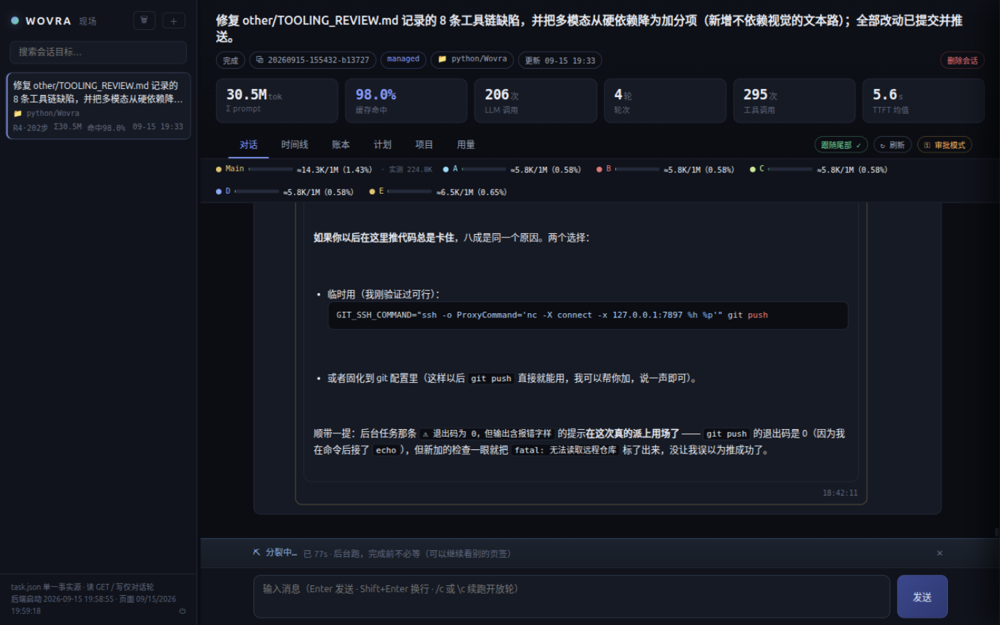
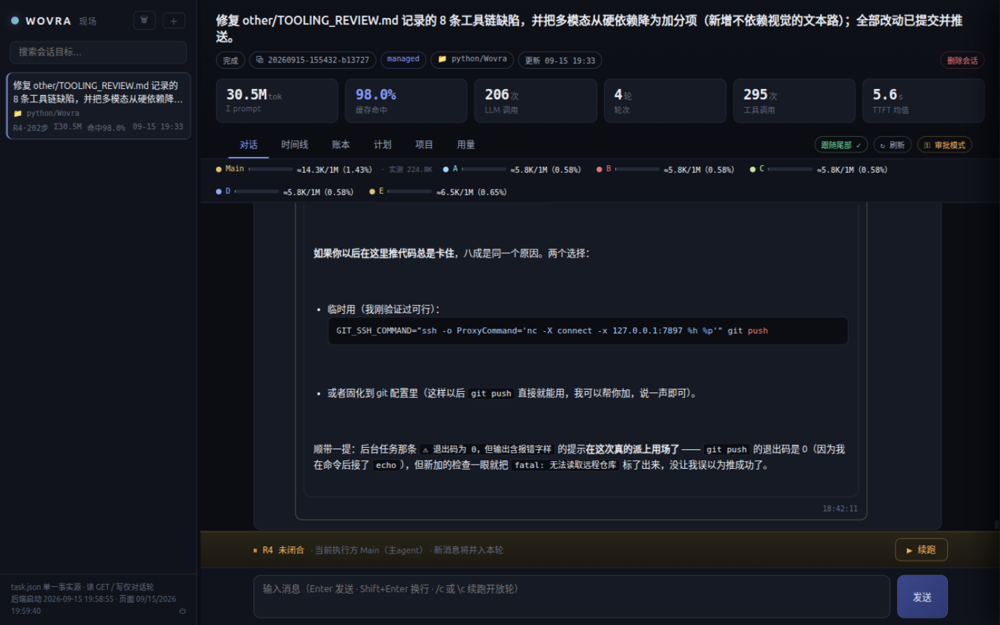
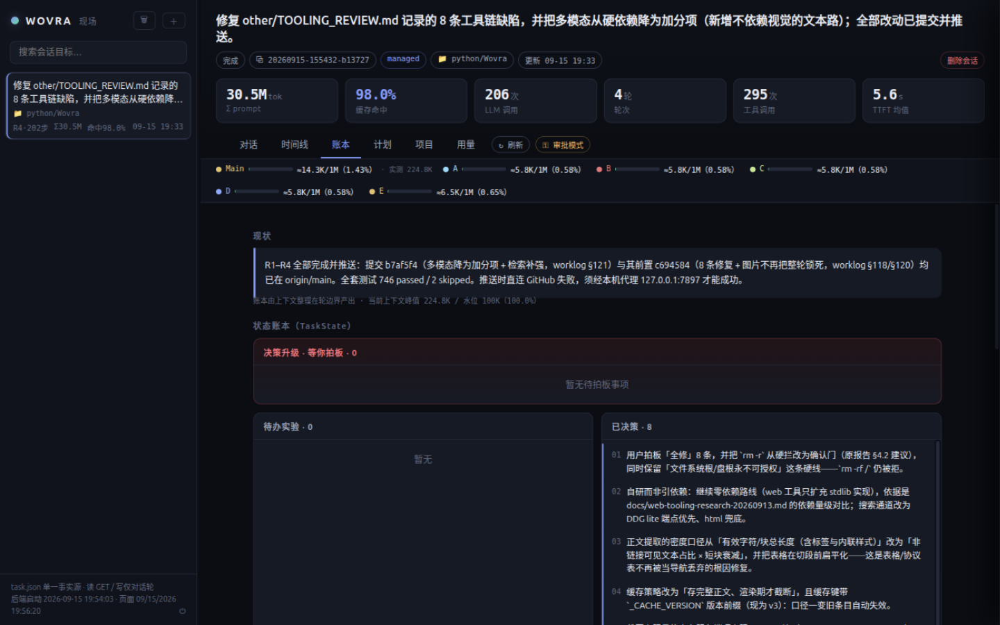
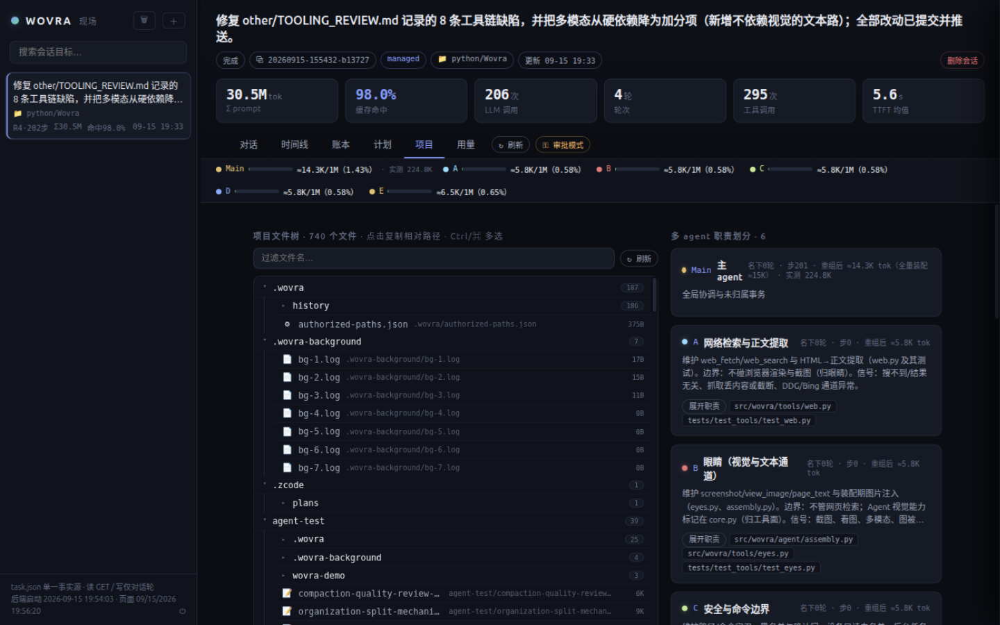
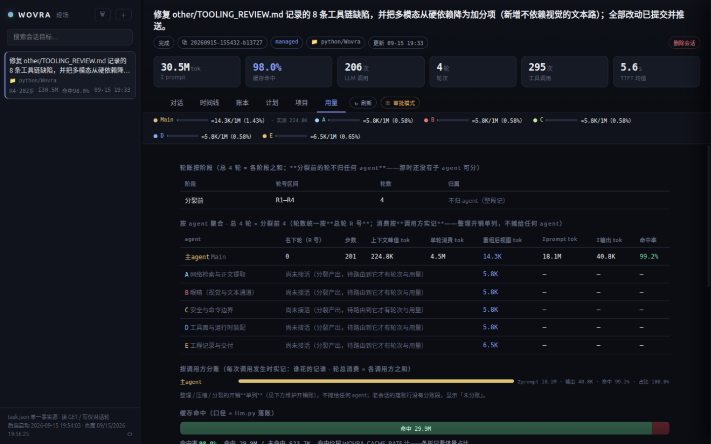

# Wovra

[English](README.md) | 简体中文

> 一个面向结构化、长时运行 AI 工作的运行时（Runtime）。

Wovra 是一个实验性系统，用于组织和管理人类与 AI 之间复杂、长时运行的工作。

Wovra 不把 AI 智能体视为一段不断累积上下文的连续对话，而是把一个任务视为一个持久的工作空间，拥有自己的**状态、上下文、进度、历史、智能体、报告和评估**。

目标不是让 AI 更聪明。

目标是让 AI 的工作变得**可管理、可观察、可引导、可恢复**。

---

## 为什么需要 Wovra？

当前的 AI 智能体正变得越来越有能力自主完成复杂任务。

然而，长时运行的任务带来了一系列不同的问题：

* 随着对话和工具调用的累积，上下文持续增长。
* 一个微小的改动，可能需要携带大量无关的历史信息。
* 失败的尝试和中间结果混杂在当前活跃的上下文中。
* 多个智能体可能重复携带相同上下文，增加协调成本。
* 人类常常无法追踪 AI 已经做了什么、还剩什么没做、为什么被阻塞。
* 解释性对话和实际工作对话可能互相干扰。
* 执行任务的 AI，不应当必然成为判定任务是否完成的最终权威。

Wovra 探索另一种思路：

> **把任务本身与处理任务所用的对话分离开来。**

---

## 核心思想

### 1. 持久的工作状态

任务并不简单地等同于一段对话。

Wovra 为工作维护一份持久的表示：

```text
Task（任务）
├── Goal（目标）
├── Requirements（需求）
├── Acceptance Criteria（验收标准）
├── Current State（当前状态）
├── Active Context（活跃上下文）
├── Report（报告）
├── History（历史）
├── Agents（智能体）
└── Evaluation（评估）
```

AI 可以从当前状态出发继续工作，而不必携带此前每一次交互的完整历史。

---

### 2. 上下文生命周期

并非所有信息都值得留在活跃上下文中。

Wovra 把信息分为两类：

```text
Active Context（活跃上下文）
      │
      ├── 相关信息
      ├── 当前决策
      ├── 当前状态
      └── 近期历史
               │
               ▼
        Archived History（归档历史）
      ├── 此前的尝试
      ├── 工具输出
      ├── 调试日志
      └── 详细对话
```

信息并不一定被删除。

相反，不必要的细节可以被折叠成一种紧凑的表示，并在需要时重新取回。

这使系统避免反复为携带无关的历史上下文付出代价。

---

### 3. 基于职责的智能体

Wovra 不认为智能体越多，执行就越快。

对于简单的任务，单个智能体可能更好。

只有当任务包含**不同的职责或上下文**时，多个智能体才会变得有用。

例如：

```text
                     Task（任务）
                      │
          ┌───────────┼───────────┐
          ▼           ▼           ▼
       Agent A     Agent B     Agent C
        规划         编码         测试
          │           │           │
          └───────────┼───────────┘
                      ▼
                  Task State（任务状态）
```

每个智能体都可以在聚焦的上下文中工作，而不是继承主任务的全部历史。

因此，隔离的目的主要在于：

**职责分离 + 上下文隔离**

而不是简单的并行执行。

---

### 4. 人机对齐

人类不应该需要持续监督每一次工具调用。

但他们应该能够在任何时刻了解工作的状态。

因此，Wovra 使用一份持久报告作为人类与 AI 之间的共享接口。

一份报告可能包含：

```text
当前状态：
正在实现认证模块。

已完成：
- API 结构
- 数据库 Schema
- 登录端点

当前问题：
Token 过期后刷新偶尔失败。

已尝试：
- 复现了该问题
- 检查了中间件的注册顺序
- 怀疑是 refresh-token 校验的问题

下一步：
排查 Token 校验与过期处理逻辑。
```

这份报告紧凑地回答了：

> 发生了什么？
> 我们现在在哪里？
> 还剩什么没做？
> 什么在阻塞我们？
> 接下来应该做什么？

---

### 5. 工作与解释是两回事

Wovra 区分**处理任务**与**理解任务**。

人类可能会问：

> "这个模块为什么这样实现？"

或者：

> "解释一下当前流水线是怎么工作的。"

这类对话不一定需要成为任务工作上下文的一部分。

只有真正改变实际工作的信息——比如新需求、新决策、新约束或新发现的事实——才应当被提升为持久的任务状态。

这样，探索性的对话就不会不必要地污染执行上下文。

---

### 6. 独立评估

一个智能体不应当是判定自己工作是否完成的唯一权威。

Wovra 将两者分离：

```text
Execution（执行）
    │
    ▼
Agent 产出结果
    │
    ▼
Evaluation（评估）
    │
    ├── 接受
    ├── 需要修改
    └── 失败
```

因此，验收标准可以独立于智能体自己的声称来进行评估。

这让长时运行的自主工作更容易验证和恢复。

---

## 架构

概念架构如下：

```text
                    Human（人类）
                      │
                 需求 / 反馈
                      │
                      ▼
              ┌───────────────┐
              │     Wovra     │
              │               │
              │  任务管理      │
              │  上下文        │
              │  状态          │
              │  报告          │
              │  归档          │
              │  评估          │
              └───────┬───────┘
                      │
                智能体编排
                      │
          ┌───────────┼───────────┐
          ▼           ▼           ▼
       Agent A     Agent B     Agent C
          │           │           │
          └───────────┼───────────┘
                      │
                      ▼
              现有智能体运行时
                      │
          ┌───────────┼───────────┐
          ▼           ▼           ▼
        文件        Shell        工具
```

Wovra 旨在专注于 **AI 工作的组织与生命周期**，而不是重新发明每一个底层能力。

现有的智能体运行时和成熟的工具实现都可以作为它的底层来使用。

### 代码结构

运行时按职责组织，每个模块只做一件事。

```text
src/wovra/
  agent/          Agent 运行时（由四个 mixin 组装）
    core.py         运行循环、轮生命周期、工具分发、用量记账
    assembly.py     每步上下文装配、紧凑/折叠视图、expand_history
    maintenance.py  水位整理 → 分裂、promote、baseline 压缩
    ledger.py       todo（大步/小步）、notify/consult、提交守卫
    prompts.py      模型可见的提示词与工具 schema（纯数据）
    support.py      运行常量与无状态工具函数（schema 生成等）
  tools/          内置工具箱
    safety.py       工作区属主、审计挂钩、路径防护、命令越界判定、确认门、禁写区、设备只读白名单
    files.py        读/写/改/删/移/回滚、搜索、检查点
    documents.py    附件原生解析：docx/xlsx/pptx/pdf/csv（纯 stdlib，零新依赖）
    shell.py        run_command、进程树强杀
    background.py   后台任务注册表与生命周期（含"退出码 0 但输出像报错"标注）
    web.py          web_search（Brave/Tavily/Serper/Exa API + 本地兜底）/ web_fetch
                    （含 SSRF 防护、正文提取、结果缓存）
    eyes.py         眼睛：screenshot / view_image / page_text（含图片尺寸上限与"未注入"说明）
    interaction.py  ask_user、用户 Hooks、当前时间
    limits.py       工具输出的统一上限与超限落盘（output/spill/）
    permissions.py  文件权限守卫（按 agent 归属限制改写删）
    status.py       工具结果成败判定的唯一权威口径
  cli/            终端入口
    main.py         argparse、子命令分发
    session.py      会话锁、任务/模式解析
    prompt.py       系统提示词组装、Agent 构造
    render.py       流式轮次渲染、历史回放
    interactive.py  chat 主循环、本地命令
  blocks/         零 LLM 的块结构
    common.py       共用底座（事件/消息形状）
    segment.py      轮 → 块（按文件聚合）
    labels.py       生命周期标签 → 标签行
    digest.py       块摘要 / 检视视图
    migrate.py      v1 粗分块 → v3 按文件聚合的加载期迁移
  task.py         持久任务树（Task、TaskState）
  lifecycle.py    文件生命周期账本
  llm.py          模型客户端（所有模型调用的唯一出口）
  tokens.py       token 估算
  ui.py           终端渲染
  truncate.py     事件索引
  pathmatch.py    路径的鲁棒匹配（模型抄的路径形态归一）
  registry.py     职责注册表（域树 → agent 条目）
  routing.py      路由与职责表（谁管什么）
  views.py        域视图材料（每个 agent 看到什么）
  economics.py    分裂经济判据（该不该裂、在哪层裂）
  split_lifecycle.py  分裂生命周期（pending/ready/rejected/skipped…）
  serve.py        Web 服务（HTTP API + 静态前端）
  __main__.py     `python -m wovra` 入口
webui/            人视图前端（纯静态：index.html + vendor）
```

---

## Web UI（人视图）

```bash
wovra serve                 # 默认 http://127.0.0.1:8600/
wovra serve --port 8612     # 换端口（可多实例并存）
WOVRA_TASKS_ROOT=/tmp/demo wovra serve   # 用另一份数据目录起演示实例（不碰真实会话）
```

**对话页**把一轮之内发生的事按时间铺开：用户原文、模型的思考与正文（MD 实时渲染）、
每一次工具调用与结果（默认折叠，点开是原文）、每个 agent 各占一个消息块。



顶栏六格是"这一刻的账"：**Σ prompt / 缓存命中率 / LLM 调用 / 轮次 / 工具调用 / TTFT 均值**。
两处口径值得说明：**工具调用**一步可以大于 1（一步里并行调多个只读工具，也就顺带看出
并行度）；**TTFT 均值只统计干活轮**——整理/分裂那种一次读 20 万 token 的批量调用不计入，
否则均值会被它们抬飞。六格在跑轮期间**按步刷新**，不必等这一轮结束。左边每个 agent
一条上下文占用条（当前/窗口 + 实测峰值）。

底部是**维护进度条**：整理与分裂跑在后台线程里，轮一闭合作业就结束了——没有它，那一两
分钟页面是全黑的。结束时在这里给出结果，**包括"被拒收/本次未分裂"的原因**。

**开放轮（未闭合）+ 续跑**：一轮只有产出最终回答才算闭合，被打断或步数用尽的轮会一直
开着，新消息并入它——界面上明确标出来，并给一个「▶ 续跑」（等价于命令行 `/c`，不注入
新消息）：



**账本页**是整理产出的现状与状态账本（决策升级 / 待办实验 / 已决策）：



**项目页**给出文件树（归属、状态、描述）与每个 agent 的**职责**及它名下的文件——职责就是
分裂阶段写的那段话，文件归属则是 Runtime 按路径机械算的：



**用量页**把账拆开：轮账按阶段归属、按 agent 聚合、缓存命中逐项对账：



> 截图取自一个真实会话（内容是本仓库自身的一次修复工作），跑在 `wovra serve` 上。
> 页面还有一个「工作目录选择器」（新建会话时挑工作区，跨平台）与审批/自主模式切换。

## 命令行与本地命令

| 命令 | 作用 |
|---|---|
| `wovra run "<目标>"` | 一次性跑完一个任务（退出前把整理/分裂做完） |
| `wovra chat [id]` | 交互会话（输入历史 / 底栏状态 / 本地命令） |
| `wovra list` · `wovra report <id>` · `wovra maint <id>` | 列会话 · 人视图报告 · 维护账 |
| `wovra views <id>` | 打印各 agent 的装配视图（排查"谁看到了什么"） |
| `wovra serve [--port N]` | 起 Web UI |
| `wovra delete <id>` | 删除会话（其本地数据一并删除） |

会话内的**本地命令**（`/` 或 `\` 前缀，零模型成本）：`/c`·`\c` **续跑**最近一个开放轮
（不注入新消息）、`/report` 报告、`/todo` 计划、`/maint` 维护账、`/bg` 后台任务、`/help`。
`Ctrl+C` 在输入行是退出、在轮运行中是中断本轮（轮保持开放，可续跑）。
`--mode managed|baseline` 切换上下文策略；`approve`（敏感操作先问）/`auto`（全放行，
适合无人值守长跑）切换安全模式。

## 工具与安全能力

* **输出默认全量**：工具输出上限 200,000 字符（`WOVRA_OUTPUT_LIMIT`）；真超限时返回开头
  预览 + 原文体量 + 落盘路径（`output/spill/`），随时可以 `read_file` 取回——**不丢文本**。
* **`tasks/` 是禁写区**：会话数据是 Runtime 的真相来源，工具层对它**拒写放读**，而且
  **不可授权**（越界访问可以授权一次，禁写区不行）。
* **网页检索走专业 API**：`Wovra_Tavily`、`Wovra_Serper`、`Wovra_Exa`、`Wovra_Bocha`、
  `Wovra_SerpAPI`、`Wovra_Firecrawl` 填哪几家都行（各家惯用名 `*_API_KEY` 与通用的
  `Wovra_SEARCH_KEY` 也认）。每次检索**随机**挑一家先试，失败就换下一家——把调用摊到各家
  免费额度上，而不是只烧第一家；`Wovra_SEARCH_PROVIDER` 可以把某家钉在第一位。返回的排序
  即结论，不再叠一层词面相关性过滤。一家都没配、或全部失败时，退回**单一**本地抓取通道
  （DDG lite，10 秒预算），并在结果里**标注"本地兜底、没有相关性保证"**：因为一句光秃秃的
  "未找到相关结果"会被模型读成"网上没有这个东西"——GAIA 实测里正是这个错误结论让 agent
  放弃了整题。（Firecrawl 同时还接在 `web_fetch` 上：自己抽不出正文时（典型是 JS 渲染站）
  改问它要干净的 Markdown。）
* **附件原生解析**：`read_file` 自动识别 `.csv`/`.tsv`（带 GBK 回退，并把实际编码写在表头）、
  `.docx`/`.xlsx`/`.pptx`（ZIP + XML）与 PDF 文本层——全部 stdlib，依旧零新依赖。此前 agent
  得自己装解析库：GAIA 实测里一道音频题的工作区留下 392MB 的 venv 加 1.9GB 的 HuggingFace
  缓存。解析不出来时直接说明并给下一步建议——**绝不返回乱码**。
* **图片上限**：模型能"看见"的图每边 ≤ **3000px**（`WOVRA_IMAGE_MAX_SIDE`，省 token），
  服务端硬上限 **8192px**（`WOVRA_IMAGE_HARD_MAX_SIDE`，实测裁定：8192 收、8193 拒）；
  超限的图**不注入**，并在下一次回复里明确告诉模型"这张图你没看到"（而不是让它编）。
  另有每回合看图预算（`WOVRA_IMAGE_VIEWS`，默认 6）提示模型基于已看过的图收口，到硬上限
  （`WOVRA_IMAGE_VIEWS_MAX`，默认 12）后续 `view_image` **直接拒绝执行**——GAIA 里两道视觉题
  就是反复裁同一张图把 900s 烧完的。
* **越界与确认**：命令默认限定在工作区内；跨工作区访问需**授权一次**并记入
  `.wovra/authorized-paths.json`；`rm -r`、`git push/reset/…` 等破坏性操作走**确认门**
  （y/N，可"以后同类"）；设备只读白名单（`/dev/tty*`、`/sys/bus/usb/devices` 等）允许
  硬件排障类只读查询，带写意图照旧拦。
* **成败判定只有一套口径**：`tools/status.py`（首行锚定 + 结构化 exit_code），CLI、前端、
  报告、文件账本共用——不再靠"正文里出现'出错'字样"瞎猜（那会 42 条假阳性）。
* **文件权限守卫**：`tools/permissions.py` 按 agent 归属限制改写删——"干不干看有没有权限，
  不看该不该"。
* **审计**：变更类工具调用留全文审计；后台任务"退出码 0 但输出像报错"会被标注出来。

## 设计哲学

Wovra 遵循几条简单的原则：

### 低成本优先

不要把 token 花在维护与当前任务无关的上下文上。

### 先隔离，后并行

多个智能体的存在，应当是因为它们的职责或上下文有实质性的不同，而不是仅仅因为并行执行看起来很厉害。

### 持久状态优于对话历史

工作的当前状态，应当比整段对话的历史更重要。

### 人类可读的进度

人类应当能够在不阅读数千条工具调用的前提下，理解一个长时运行任务的状态。

### 可恢复性

失败、此前的尝试和决策应当保持可恢复，而不是在上下文被压缩时消失。

### 评估独立于执行

执行工作的系统，不应当是判断工作是否成功的唯一裁判。

---

## 与现有智能体工具的关系

Wovra 不打算取代现有的编码智能体或工具运行时。

它可以作为它们之上的编排层来运作。

例如：

```text
                    Wovra
                      │
        ┌─────────────┼─────────────┐
        ▼             ▼             ▼
   智能体运行时    智能体运行时    智能体运行时
        │             │             │
        ▼             ▼             ▼
      工具           工具           工具
```

这使得在不改变上层任务组织模型的前提下，试验不同的底层智能体成为可能。

---

## 当前状态

> **机制基线阶段（V3）。** 上下文管理机制经过真实多轮任务对照实验
> 验证并封版（见 [docs/context-management-v3.md](docs/context-management-v3.md)）。
> 组织层已以**上下文分化**形态落地：水位整理与分裂分析是**串行两阶段纯追加管线**
> （org → split，org 失败则 split 跳过），注册表在单运行时内分流（单向 notify /
> 双向 consult）。**人视图前端已落地**（`wovra serve` + `webui/`，见
> [Web UI](#web-ui人视图)）。下一站：真实长任务验证 + 独立任务评估。

* [x] 最小智能体运行时（managed **32** / baseline **22** 个工具：文件 / 命令 / 后台任务 / 网络检索 / **眼睛（截屏·看图·页面文本）** / 交互确认 / 计划账本 / 历史展开 / 路由 / 单向通知与双向咨询 / 会合 / 职责更新 / **整理与分裂的提交口**）
* [x] 任务表示与持久任务状态（Task / TaskState / report.md / 会话绑定工作区）
* [x] 上下文管理 V3：执行期零截断、窗口保底、文件地图、锚点自愈
* [x] 水位触发的批量整理 → 分裂（**串行两阶段纯追加管线**；整理产物在**轮闭合边界即时生效**，异步维护迟到时以下一轮开启兜底；老轮按文件现状折叠）
* [x] 分裂产物 = **结构树 + 每个 agent 的职责**（节点用 `path`/`paths` 声明范围）：文件归属（按最深路径前缀）、文件级描述（取文件开头）、非 LIVE 文件挂载、是否分裂与在哪层分裂，全部由 Runtime 机械算；产物**不可信就不分裂**（被截断或覆盖不全时保留整理结果、等下一批水位再判断——"错误分裂不如不分裂"）
* [x] 安全机制（**禁写区**（`tasks/` 只读、不可授权）+ 黑名单 + 敏感确认（`rm -r`、git 破坏性操作走确认门）+ 设备只读白名单 + 过期保护 + 审计 + 原子落盘）
* [x] 成本核算（三分账 / 等效输入 / 上下文占用 / 缓存命中，逐轮落盘）
* [x] 对照实验两轮（managed vs baseline，见下方实测结果）
* [x] 基于职责的智能体隔离，以「上下文分化」实现：**分裂阶段**产出结构树与职责，注册表 + 单向 notify / 双向 consult 在单运行时内分流——是整理的自然产物（单 agent 分流，非同步多 Agent）
* [x] 人视图前端：`wovra serve`（六页签 + 顶栏六格 + 维护进度条 + 开放轮续跑 + 工作目录选择器）
* [ ] 开放/大范围任务的开工前规划闸门（已写意图存档，未实现）
* [ ] 重度场景验证（合成长轨迹回放 + 真实长任务）
* [ ] 独立任务评估

## 实测结果

两个受控对照会话（同一 Gradio 项目、同一冻结起始文件、同一任务书
"逐轮实现 10 个功能"，A = managed 14 轮 / B = baseline 15 轮）：

| | A managed | B baseline | B/A |
|---|---:|---:|---:|
| 名义 token | 2,255,448 | 4,966,437 | 2.20× |
| 等效输入（缓存折算） | 377,668 | 475,686 | 1.26× |
| 含管理开销 | ≈475,779 | ≈475,686 | ≈1.00× |
| 步数 | 112 | 153 | 1.37× |

三个关键结论（细节见 [docs/context-management-v3.md](docs/context-management-v3.md)）：

1. **执行期截断是反优化**：三代机制实测——轮内折叠 39 次重读、2KB
   锁孔 11 次沉没读取，零截断后同量级任务 3 次读取完成；
2. **缓存命中率是折扣，基座才是税基**：baseline 命中率 99.3% 仍会在
   臃肿基座上付出高昂代价，管理机制的目标是基座而非命中率；
3. **每轮必整理是过早优化**：14 轮整理 98K tok（约 7K/轮，轻轮整理
   费超过干活费）——V3 改为水位触发的批量合并整理。

完整数据与推导：[docs/managed-vs-baseline-11rounds.md](docs/managed-vs-baseline-11rounds.md) ·
[docs/round11-context-experiment.md](docs/round11-context-experiment.md) ·
[docs/context-management-v3.md](docs/context-management-v3.md)

## 文档

| 文档 | 内容 |
|---|---|
| [docs/context-management-v3.md](docs/context-management-v3.md) | 机制定稿 V3（实验修正版，当前基线） |
| [docs/context-management-explained.md](docs/context-management-explained.md) | 机制通俗详解 |
| [docs/context-runtime-v2.md](docs/context-runtime-v2.md) | V2 设计定稿（历史，含修订记录） |
| [docs/managed-vs-baseline-11rounds.md](docs/managed-vs-baseline-11rounds.md) | 观察性对照数据 |
| [docs/round11-context-experiment.md](docs/round11-context-experiment.md) | 三代机制对照实验 |
| [docs/preflight-planning-intent.md](docs/preflight-planning-intent.md) | 开放/大范围任务的开工前规划闸门（意图存档，未实现） |
| [docs/venv-usability-prompt-reconcile-20260911.md](docs/venv-usability-prompt-reconcile-20260911.md) | 运行者体验改进：venv 可用性 + 提示词对账（2026-09-11） |
| [docs/organization-split-explained.md](docs/organization-split-explained.md) | 整理 → 分裂机制详解（含产物形状与生效时机） |
| [docs/context-differentiation-runtime.md](docs/context-differentiation-runtime.md) | 上下文分化运行时（职责域与视图装配） |
| [docs/worklog-20260911.md](docs/worklog-20260911.md) | 工程日志：每次改动的动机 / 证据 / 回滚（持续更新） |
| [docs/maint-progress-command-20260911.md](docs/maint-progress-command-20260911.md) | 维护进度记账（整理/分裂的成本与状态） |
| [experiments/README.md](experiments/README.md) | 受控实验协议与工具 |

## 开发者须知

**安全层 vs venv（2026-09-11）。** `run_command` 会拒绝"离开工作区"的命令，
包括**界内指向界外的符号链接**（`_linked_outside`）。uv 创建的
`.venv/bin/python` 恰恰是这种链接——它指向系统解释器——所以
`.venv/bin/python -m pytest` **按设计会被拦**。请改用 `uv run`：

```bash
uv run python -m pytest        # 跑测试
uv run python -m wovra --help  # CLI 冒烟
```

当这类命令被拦时，`run_command` 现在会附带一条指向 `uv run` 的提示；
系统提示词也要求模型优先用 `uv run`，不要直接调 `.venv/bin/...`。
如果确实需要访问工作区之外，请说明理由并请人代为操作——沙箱不会替你越界。

**`tasks/` 只读（2026-09-15）。** 工作区里的 `tasks/` 是**会话记录的真相来源**
（轮/块/注册表/报告），只由 Runtime 落盘。工具层对它**拒写、放读**：文件类工具的
写/改/替换/恢复/删/移一律拒绝，`run_command` / `run_background` 里"写到 `tasks/`"
的命令也拒绝（**不可授权**，与越界访问不同）；读取完全不受限——`read_file` /
`search_files` / `glob_files` 照旧，复盘会话数据不需要额外许可。自定义只读目录用
环境变量 `WOVRA_READONLY_DIRS`（`os.pathsep` 分隔）追加。

完整的安全设计见
[docs/context-management-v3.md](docs/context-management-v3.md) 与
[agent-test/security-hardening-20260910.md](agent-test/security-hardening-20260910.md)。

---

## 路线图

### 阶段 1 —— 最小运行时

构建最小但完整的执行循环：

```text
用户
 ↓
LLM
 ↓
工具调用
 ↓
工具执行
 ↓
结果
 ↓
LLM
 ↓
...
```

目的是先建立一个能跑通的基础，而不是去优化它。

### 阶段 2 —— 任务状态

引入持久的：

* 目标
* 需求
* 状态
* 报告
* 历史
* 验收标准

### 阶段 3 —— 上下文生命周期

实现：

* 上下文选择
* 压缩
* 折叠
* 归档
* 检索
* 上下文隔离

### 阶段 4 —— 智能体编排

引入基于职责的智能体与受控的任务委托。

### 阶段 5 —— 人机协作（**大部分已落地**）

`wovra serve` + `webui/` 已提供：进度查看（六页签 + 顶栏六格 + 维护进度条）、干预
（终止本轮 / 开放轮续跑）、审批（approve/auto 切换、确认门）、恢复（会话持久化 + 崩溃后接着做）。
**任务修改**（在界面上直接改目标/约束/计划）与**解释性会话**仍在路上。原清单：

加入：

* 进度查看
* 干预
* 任务修改
* 审批
* 恢复
* 解释性会话

### 阶段 6 —— 评估

构建独立判定任务是否满足验收标准的机制。

---

## 长期愿景

Wovra 探索一个简单的问题：

> **如果 AI 可以连续工作几个小时甚至几天，那么围绕 AI 的系统应该是什么样的？**

如今的智能体接口往往以对话为中心。

Wovra 探索一种以**工作**为中心的模型：

```text
Conversation（对话）
      ↓
      ↓
      ↓
     Task（任务）
      │
      ├── 状态
      ├── 上下文
      ├── 智能体
      ├── 报告
      ├── 历史
      └── 评估
```

长期目标是让复杂的 AI 工作给人的感觉，不再是：

> "我让一个 AI 去做了某件事。"

而更接近：

> **"我向一个智能系统指派了一份工作，并且在任何时点，我都能理解它、引导它、检查它、恢复它。"**

---

## 许可证

许可证待定。
